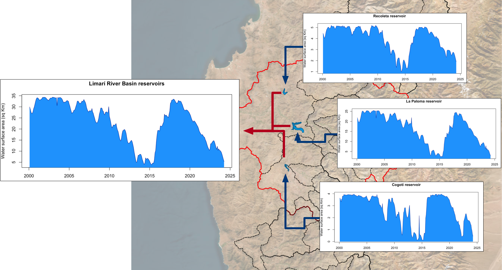
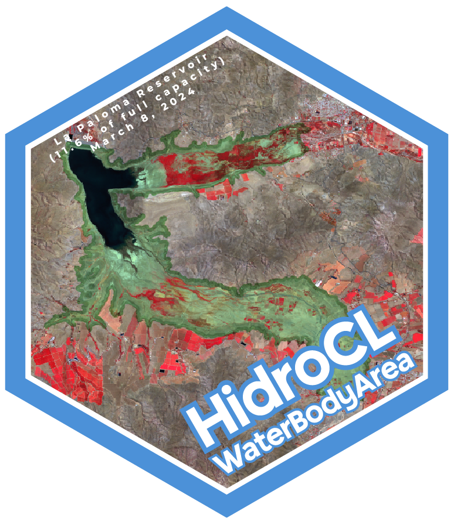

# HidroCL-WaterBodyArea

## Description

This repository contains 4 files to compute the water body area of a reservoir using the HidroCL dataset. The files are:

- `1_get_data.py`: This script downloads raw reservoir surface area data using one of the two reservoir datasets uploaded here (Chile big water bodies from Donchyts et al. (2022) or custom water bodies from the HidroCL dataset). This process can be done for small range of date in the case of big water bodies. The script is set to upload data in monthly intervals.

- `2_order_data.py`: This script gathers the raw data and orders it in a single file.

- `3_clean_data.py`: Clean data from large gradients and outliers.

- `4_get_hidrocl_area.py`: Compute the water body area of a reservoir using the HidroCL dataset. This scripts check if the water body is inside each HidroCL polygon and summarize the area of the water body.

## Description figure

## Reference

Donchyts, G., Winsemius, H., Baart, F. *et al*. High-resolution surface water dynamics in Earth’s small and medium-sized reservoirs. *Sci Rep* **12**, 13776 (2022). https://doi.org/10.1038/s41598-022-17074-6

    

